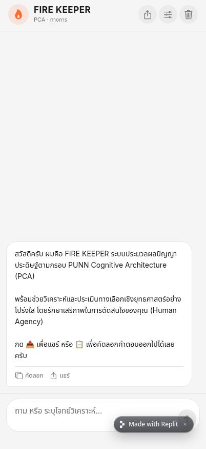

# FIRE KEEPER OS

FIRE KEEPER OS คือแอป Expo และ API สำหรับการวิเคราะห์คำถามอย่างโปร่งใส โดยแยกคำตอบสำหรับผู้ใช้ออกจากหลักฐาน, สมมติฐาน, reasoning trace, verification และ system trace

โปรเจกต์นี้มีสองส่วนหลัก:

- **FIRE KEEPER mobile/web app** — อินเทอร์เฟซสนทนาที่สร้างด้วย Expo และ React Native Web
- **API server** — Express API ที่รัน PCA pipeline, persistent memory, report layers และ Research Evaluation Framework

## ความสามารถหลัก

- รองรับคำตอบภาษาไทยและภาษาอังกฤษ
- จำแนก intent: explanatory, decision, summary, comparison และ general
- แยก facts, assumptions, unknowns และ conflicts
- ประเมิน evidence และ confidence พร้อมคะแนน `/100`
- ตรวจ verification และ logical verification หลังสร้างคำตอบ
- แสดง User Report, Analyst Report และ System Trace แยกกัน
- ส่งออก User Report, Analyst Report และ System Trace เป็น HTML/PDF
- ใช้ PostgreSQL + Drizzle ORM สำหรับ persistent memory
- สร้างโลกจำลองและ ground truth สำหรับ Research Evaluation
- สร้าง plausibility claims, counterfactual scenarios และวัด:
  - Truth Accuracy
  - Reasoning Quality
  - Calibration Error
  - Robustness
  - Consistency
  - Generalization

> Research Evaluation เป็นโหมดแยกแบบ opt-in และไม่เปลี่ยนคำตอบสนทนาปกติ

## ภาพตัวอย่าง



ภาพนี้เป็น screenshot จากแอปจริงบน mobile viewport

## โครงสร้าง repository

```text
artifacts/
  api-server/       Express API และ PCA/Research Evaluation pipeline
  fire-keeper/      Expo mobile/web application
  mockup-sandbox/   Component preview server
lib/
  db/               PostgreSQL schema และ Drizzle ORM
  api-client-react/ Generated API client
  api-spec/         OpenAPI/codegen configuration
  api-zod/          Shared API validation
screenshots/        ภาพตัวอย่างจากแอป
scripts/            workspace และ post-merge scripts
```

## สิ่งที่ต้องมี

- Node.js 24
- pnpm
- PostgreSQL database
- OpenAI API access สำหรับคำตอบและ Research Evaluation

ติดตั้ง dependencies:

```bash
pnpm install
```

## Environment variables

คัดลอกไฟล์ตัวอย่าง:

```bash
cp .env.example .env
```

ค่าที่ต้องมี:

- `DATABASE_URL` — PostgreSQL connection string
- `OPENAI_API_KEY` — ใช้โดย API server สำหรับ Communication stage และ AI Under Test
- `SESSION_SECRET` — secret สำหรับ session/configuration ที่เกี่ยวข้อง
- `PORT` — port ที่ API server ต้อง bind; Replit workflow จะกำหนดค่าให้

สำหรับ Expo บน Replit ค่า `EXPO_PUBLIC_DOMAIN`, `EXPO_PUBLIC_REPL_ID`, `REPLIT_DEV_DOMAIN` และค่าที่เกี่ยวข้องกับ Metro จะถูกเติมโดย workflow ใน `package.json` ของแอป

ห้าม commit `.env` หรือค่า secret จริง ให้ใช้ Replit Secrets หรือ environment manager ของ deployment

## รันในเครื่อง

### API server

```bash
pnpm --filter @workspace/api-server run dev
```

API server จะ bind ตาม `PORT` และมี endpoints สำคัญ:

```text
GET  /api/healthz
GET  /api/memory
POST /api/memory
POST /api/memory/clear
POST /api/chat
POST /api/analyze
POST /api/analyze/research-evaluate
```

### Expo app

```bash
pnpm --filter @workspace/fire-keeper run dev
```

บน Expo CLI:

- กด `w` เพื่อเปิด web
- กด `a` เพื่อเปิด Android
- ใช้ QR code เพื่อเปิดใน Expo Go

ใน Replit ให้เปิด workflow `artifacts/fire-keeper: expo` เพื่อให้ preview ใช้ domain และ proxy ที่ถูกต้อง

### Database schema

เมื่อมีการเปลี่ยน schema ให้ตรวจสอบ environment ก่อน แล้วรันใน development database:

```bash
pnpm --filter @workspace/db run push
```

อย่ารันคำสั่ง schema push กับ production database โดยไม่ตรวจ migration และผลกระทบก่อน

## ตรวจสอบคุณภาพ

Typecheck ทั้ง workspace:

```bash
pnpm run typecheck
```

ตรวจเฉพาะ API:

```bash
pnpm --filter @workspace/api-server run typecheck
```

ตรวจเฉพาะ Expo:

```bash
pnpm --filter @workspace/fire-keeper run typecheck
```

Regression suite ของ PCA และ Research Evaluation:

```bash
pnpm --filter @workspace/api-server exec tsx src/__tests__/regression.ts
```

Build API:

```bash
pnpm --filter @workspace/api-server run build
```

## Research Evaluation Framework

เปิดจาก Settings ในแอปด้วยปุ่ม **Run Research Evaluation**

Pipeline มีลำดับดังนี้:

```text
Truth Source
      ↓
World Generator
      ↓
Truth Engine
      ├── Plausibility Generator
      └── Counterfactual Generator
                    ↓
              Test Instance
                    ↓
              AI Under Test
                    ↓
        Evaluation Layer / Metrics
```

Truth Accuracy จะเทียบคำตอบกับผลจาก Truth Engine โดยตรง ส่วน self-label และ reasoning trace จะถูกประเมินแยกใน Explanation Consistency เพื่อไม่ให้การประเมินปนกัน

## หลักการออกแบบ

- คำตอบสำหรับผู้ใช้ต้องมาก่อน audit และ audit ห้าม rewrite, retry หรือ block คำตอบ
- `user_input` เป็น context ไม่ใช่ factual evidence
- Analyst Report ใช้ข้อมูล audit ที่ตรวจสอบย้อนกลับได้ แต่ไม่เปิดเผย private chain-of-thought
- Persistent memory ใช้ PostgreSQL เป็น source of truth
- เวลาแสดงผลใช้เขตเวลา `Asia/Bangkok`
- ผู้ใช้ยังเป็นผู้ตัดสินใจขั้นสุดท้ายเสมอ

## การมีส่วนร่วม

ดูรายละเอียดใน [CONTRIBUTING.md](CONTRIBUTING.md)

โดยสรุป:

1. สร้าง branch แยกสำหรับการเปลี่ยนแปลง
2. รักษาขอบเขตระหว่าง user-facing answer กับ audit metadata
3. เพิ่ม regression test เมื่อเพิ่มหรือเปลี่ยน report contract
4. รัน typecheck, regression และ `git diff --check` ก่อนเปิด pull request

## License

โปรเจกต์นี้เผยแพร่ภายใต้ [MIT License](LICENSE)